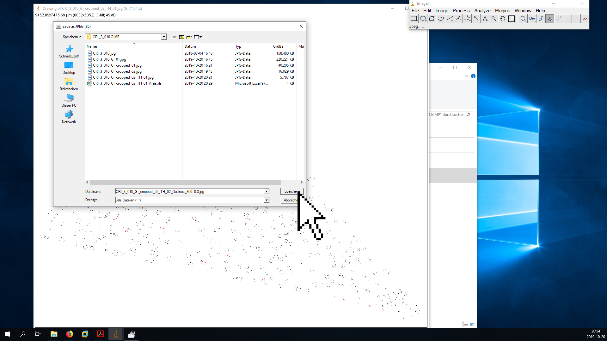

Processing microtome slides with GIMP and ImageJ
================
Roman M. Link

# Introduction

This is a step-by-step tutorial for the pre-processing and analysis of
wood anatomical microtome slides via semi-automatic image
classification. The methodology is based on our original tutorials that
were using [Photoshop](https://www.youtube.com/watch?v=dQw4w9WgXcQ) and
[ImageJ](https://imagej.nih.gov/ij/). Due to the financial pressure
posed new subscription-based payment system introduced by Adobe, we felt
compelled to switch to a fully open-source solution, which is why our
analysis is now using [GIMP](https://www.gimp.org/) for the steps
previously done in Photoshop. Both GIMP and ImageJ are very powerful
software packages, and a full introduction to their functionalities is
beyond the scope of this tutorial. However, note that a list of useful
GIMP shortcuts can be found here:
(<https://www.gimpusers.com/gimp/hotkeys>).

We are aware that our methods is by no means the perfect way of
analyzing wood anatomical slides, and there may be less time consuming
ones. However, it ensures comparability to our old datasets obtained by
(almost) the same method, and has the advantage of allowing for an
accurate assessment of classification errors during all steps of the
analysis.

Note that the term `CODE` in this document is a placeholder that has to
be replaced by the unique ID of sample you are working with\! In the
screenshots in the example, the `CODE` is `CRI_3_010`.

# Preparation in GIMP

  - Open original image `CODE.jpg`

  - Select the Polygon Lasso tool (GIMP shortcut: *F*) and cut out xylem
    and pith (double click to finish selection process)
    

  - Copy selection (*Ctrl + C*)

  - Paste selection to new file (*Ctrl + Shift + V*)
    

  - Close tab with original image (do *not* save changes\!)
    

  - Zoom in to focus on the pith (*+/-* or *Ctrl + mouse wheel*), select
    the Polygon Lasso tool (*F*) and cut out the pith
    

  - Export the new picture (full xylem area with cut-out bark and pith)
    as `CODE_GI_01.jpg` (export as: *Ctrl + Shift + E*) using the
    maximal quality setting - the GI in the name codes the GIMP step

  - Zoom in to focus on the pith (*+/-* or *Ctrl + mouse wheel*), select
    the Polygon Lasso tool (*F*) and cut out the pith
    

  - If the analyzed cross-section is very large, the vessel size is very
    small compared to the sample area and/or there are areas with
    severely damaged vessels, it may be advantageous to select only a
    wedge of the original picture with the Lasso tool (*F*) and insert
    it to a new file (*Ctrl + Shift + V*) instead of analyzing the
    entire cross-section to save time. In this case, be careful to
    select a representative section of the sample (i.e., avoid tension
    and compression wood). The best is to trace the ray parenchyma to
    avoid including incomplete vessels. 

  - if you decide to work with a subsection of the original xylem area,
    save as `CODE_GI_cropped_01.jpg` (export as: *Ctrl + Shift + E*) and
    perform the following steps with this file instead of the original
    file.

  - \[optionally\] adjust brightness and contrast using color curves
    (German: **Farben ➜ Kurven**, English: **Colors ➜ Curves**)
    
      - move the lower point close to the left end of the histogram to
        make sure the darkest portions of the image are actually black
        (facilitates thresholding)
      - if necessary, raise part of the upper right portion of the curve
        above the 1:1 line to increase the brightness of the brightest
        portion of the image (can be helpful if vessels are partially
        occluded)
      - This procedure is meant to increase the contrast between vessel
        lumina and xylem tissue, but take care that the correction does
        not affect the size of individual vessels (zoom in to the single
        vessel level to check that no vessels are resized\!). This step
        is only a pre-processing step for the thresholding algorithm in
        ImageJ, so the separation between light and dark areas does not
        have to be perfect.

  - save the image in GIMP’s `.xcf` format as `CODE_GI.xcf` or
    `CODE_GI_cropped.xcf`. This file will be used later for the
    different post-processing steps necessary to improve the initial
    image classification.

  - decompose image into its RGB components (German: **Farben ➜
    Komponenten ➜ Zerlegen**, English: **Colors ➜ Components ➜
    Decompose**) - this creates a new image that separates the original
    image into its red, green and blue channel

  - hide all layers except the green layer by clicking on the eye symbol
    in the *Layers* panel, then export (*Ctrl + Shift + E*) the new
    image as `CODE_GI_02.jpg` or `CODE_GI_cropped_02.jpg` (depending on
    whether or not you work with a cropped subsample)

  - close the tab with the black and white image.

# Preliminary analysis in ImageJ

  - open ImageJ.
  - open the original image with the scale bar (`CODE.jpg`) with ImageJ
    (either by the File dialog or by dragging and dropping onto the
    ImageJ window).
  - zoom in (*Strg + mouse wheel*) and move the image with the hand tool
    (or by holding & clicking while pressing the space bar) until the
    scale bar fills the entire screen.
  - use the **Straight Line** tool to draw a line on top of the scale
    bar that goes from one endpoint to the other (it can be helpful to
    first roughly position it and then zoom in more. The endpoints of
    the **Straight Line** can be repositioned by holding and clicking.
    The zoom function in ImageJ is atrocious, so do not lose hope when
    the line disappears - it normally shows up again when you scroll a
    bit or change the degree of magnification)

  - Set the scale to the appropriate value by going to the **Analyze ➜
    Set Scale** menu 

  - In the corresponding dialog, set the **Known Distance** (the value
    above the scale bar), the **Unit of length** (normally µm; see scale
    bar) and - *very important* - mark the box **Global** to make sure
    that the scale is the same accross all opened documents
    

  - Open the modified image `CODE_GI_02.jpg` or `CODE_GI_cropped_02.jpg`
    with ImageJ (drag & drop onto ImageJ bar) - if the scale is
    correctly set, the dimensions of the picture in the unit you
    specified (likely µm) should be visible in the upper left corner (if
    not, the dimensions are shown in pixels).

  - Transform the grayscale image into a threshold image
    
      - zoom in until individual vessel lumina are visible.
      - Open the **Threshold** dialog (**Image ➜ Threshold** or *Ctrl +
        Shift + T*).
      - Choose the options **Default** and **B\&W** and mark the box
        **Dark background**.
      - Move the upper slider to find a threshold value that properly
        separates vessel lumina from background tissue without
        shrinking/increasing their size, and with minimal occurrence of
        “fuzzy edges” (the program calculates an “optimal” value based
        on criteria which may or may not be useful in your case, so play
        around – if the contrast was not adjusted, a value between 100
        and 130 is usually sensible, but note that especially if you
        adjusted the color curves or performed a different type of
        contrast correction the perfect value may be well outside that
        range)
      - press **Apply** and close the **Threshold** window

  - Save this image as `CODE_GI_02_TH_01.jpg` or
    `CODE_GI_cropped_02_TH_01.jpg`
      - do NOT use the Save/Save As shortcut, because it will
        automatically save in `.tiff` format
      - instead, use the **File ➜ Save As ➜ Jpeg** dialog

  - Now, zoom out and measure the area of the sample
      - use the Wand tool to click into the black area around the sample
        - a portion of the black area will now be selected (highlighted
        by a barely visible yellow outline)
      - measure the size of the selected area using *Ctrl + M* (or
        **Analyze ➜ Measure** if you prefer point and click)
      - if you work with a full cross-section and removed the pith, do
        not forget to measure this region\!
      - if the surrounding area is separated in several portions, repeat
        the previous steps for all of them
      - finally, press *Ctrl + A* to select the entire image and measure
        with *Ctrl + M*

  - open the saving dialog by clicking File ➜ Save As in the **Results**
    window and save as `CODE_GI_02_TH_01_Area.xls` or
    `CODE_GI_cropped_02_TH_01_Area.xls`. The results in that file can be
    used to calculate the area of the analyzed wood portion by
    substracting the surrounding black area from the total area of the
    image.

  - Use the **Flood Fill** tool to replace the surrounding black area
    (and, if applicable, the pith) with a solid white color.
    

  - Save the image without the black area as `CODE_GI_02_TH_02.jpg` or
    `CODE_GI_cropped_02_TH_02.jpg`

  - To prepare for automated vessel detection, open the **Analyze ➜ Set
    Measurements** dialog and select **Area**, **Shape descriptors**,
    **Perimeter**, **Fit ellipse** and **Feret’s diameter**

  - Open the **Analyze ➜ Analyze Particles** dialog
  - You can specify the following conditions each particle has to meet
    to be included into the analysis
      - **Size** (µm²): range of area for the included vessels (the
        minimum is normally the more important value becuase it helps to
        exclude tracheids. For temperate species, a minimum of 100-300
        is normally reasonable. The maximum value can usually be left at
        *Infinity* unless e.g. there are large resin chanels you want to
        exclude.)
      - **Circularity**: The roundness of the vessels (from 0: not round
        at all to 1: perfect circles. This can be helpful to exclude
        brick-shaped parenchyma cells if they are in the same size range
        as vessels, but may also lead to an exclusion of damaged
        vessels. Values of 0.3/0.4-1.0 are usually reasonable.)
  - before clicking **OK**, make sure to select **Show: Outlines**, and
    mark **Display Results**, **Clear Results** and **Include Holes**.

  - Save the resulting outlines as a `.jpg` document, specifying the
    selected **Area** and **Circularity** values in the name
    (e.g.`CODE_GI_02_TH_02_Outlines_300,0.3.jpg` or
    `CODE_GI_cropped_02_TH_02_Outlines_300,0.3.jpg`) using the File ➜
    Save As ➜ Jpeg option in the main menu of ImageJ (not the newly
    opened **Results** window\!). Make sure the right image window is
    selected when saving.

# Error adjustment in GIMP

  - Open the file `CODE_GI.xcf` (or `CODE_GI_cropped.xcf`) in GIMP. Drag
    the files `CRI_3_010_GI_02_TH_02.jpg` (or
    `CRI_3_010_GI_cropped_02_TH_02.jpg`) and
    `CRI_3_010_GI_02_TH_02_Outlines_300, 0.3.jpg` (or
    `CRI_3_010_GI_cropped_02_TH_02_Outlines_300, 0.3.jpg`) on top of
    this file (inside the image area) to add them as additional layers

  - Click on the foreground color (Vordergrundfarbe) symbol in the left
    GIMP pane and change the color to green (00ff00 in hexadecimal HTML
    notation)

  - Right click in the layer pane (bottom right) and open the **New
    Layer** (**Neue Ebene**) dialog. Set the layer name to “green” and
    make sure to fill the layer with the foreground color (Füllung:
    Vordergrundfarbe) to create a brightly green layer

  - Double click on the layer names to rename them to make it easier to
    recognize them and rearrange them in the following order (from top
    to bottom)
      - Original: **org**
      - Outlines: **out**
      - Green layer: **green**
      - Threshold: **thresh**

  - Right click on the layer **out** and add a alpha channel
    (**Alphakanal hinzufügen**) to allow for transparency

  - Click on the eye symbol next to the **org** layer to temporarily
    render it invisible
  - select the **out** layer by clicking on it, then choose the wand
    tool (click into image window, then press *U*), click into the
    select the area surrounding the identified conduits and cut it out
    with *Ctrl + X*. The outcome should look like that:

  - restore the visibility of **org** and deselect all by pressing *Ctrl
    + Shift + A*
  - use the Layers (Ebenen) panel to change the mode (Modus) and opacity
    (Deckkraft) of the three layers to the following values:
      - **org** Mode: Darken only (Nur Abdunkeln); opacity: 80%
      - **out** Mode: Difference (Unterschied); opacity: 80-90%
      - **green** Mode: Lighten only (Nur Aufhellen); opacity: 100%
      - **thresh** Mode: Normal, opacity: 100% (leave unchanged)

  - the image is now ready for editing. Press *Ctrl + S* to save the
    progress.
  - if you set the layer attributes correctly, all areas that are black
    in the threshold image and that have been identified as vessels by
    ImageJ’s **Analyze Particles** tool are displayed in red. All areas
    that are black in the threshold image but were excluded by the
    **Analyze Particles** tool are displayed in green. The original
    image is overlayed to enable you to identify how the area looked
    like in the original image.
  - in the following, you will edit the threshold image (layer
    **thresh**) with the pencil tool (shortcut: *N*) to help the
    **Analyze Particles** algorithm identify vessels with damaged walls
    (false negatives: green in the image, but should be red), and to
    remove elements that were mistakenly identified as vessels, such as
    resin canels and parenchyma cells (red in the image, but should be
    green)
  - as a first step, check if there are indications that your ImageJ
    settings should be changed
      - large amount of little tracheids and parenchyma cells included:
        *minimum size too small*
      - large amount of smaller vessels not included: *minimum size too
        large*
      - large amount of blocky parenchyma cells included that are of
        similar size as the vessels: *minimum roundness too small*
      - large amount of vessels not included because of small wall
        damages: *minimum roundness too large*
      - If consistently, all vessels are too small or too big compared
        to the original image, consider changing the *threshold* value
  - a certain amount of missclassification is unavoidable, but if there
    are obvious patterns of false negatives/positives it is better to
    re-run the classification with different parameters and create a new
    outline image that can be copied into the `.xcf` file as a new layer
    `out1`, `out2` etc. (or, in the worst case, set a new threshold)
    than trying to fix all the errors by hand
  - if you are confident that you have found the right ImageJ settings,
    you can start looking for classification errors that need correction
    - see the following examples:

  - to manually fix classification errors first make sure that while
    editing the *foreground/background colors are black and white*
    (000000 and ffffff), **not green** and that the *threshold layer is
    selected for editing*

  - you can now use the pencil tool (shortcut: *N*) to edit the
    threshold image
    
      - complete damaged or missing vessels with black
      - remove miss-classified areas (tracheids, resin channels etc.)
        with white
      - you can use *X* to switch between foreground/background colors
      - use *Alt + up/down arrow* or *Alt Gr + mouse wheel* to change
        the pencil size

  - After editing, the image with the fixed errors will look somewhat
    like that: 

  - areas that were (erroneously) classified as vessels that now are
    removed from the threshold image are **black**

  - new additions to the threshold image apear as **green**

  - anything that gets removed from the threshold image and was not
    classified as vessels before is displayed in **white**
    (e.g. tracheids - if they are to small to get classified, it does
    not matter if you leave or remove them since they do not affect the
    results)

  - do not spend too much time editing out even the tiniest flaws.
    Vessel conductivity scales with the 4th power of vessel diameter, so
    a vessel with 50% of the diameter of another vessel only has 6.25%
    of its conductivity. For that reason, direct your focus on bigger
    vessels.

  - when you finished editing, save the `.xcf` file (*Strg + S*).

  - now select the threshold layer and press *Ctrl + A*, *Ctrl + C* and
    then *Ctrl + Shift + V* to mark and copy the entire area of the
    image and paste it into a new image.

  - press *Ctrl + Shift + E* to export this file as
    `CODE_GI_02_TH_02_edit.jpg` (or `CODE_GI_cropped_02_TH_02_edit.jpg`)

# Final analysis in ImageJ

  - open the new threshold file in GIMP (make sure that the scale is
    still set correctly by looking at the units in the upper left corner
    - if not, follow the steps in Chapter 2. to reset it)

  - add a threshold by pressing *Ctrl + Shift + T* (or **Image ➜ Adjust
    ➜ Threshold**)
    
      - the threshold value does not matter since the image is only
        black and white
      - depending on the geometry of the sample, it may be necessary to
        uncheck the **Dark Background** box to make sure that the
        background is white and the vessels black

  - repeat the particle analysis step (**Analyze ➜ Analyze Particles**)
    with the same settings as before

  - save the outlines as `CODE_GI_02_TH_02_edit_Outlines_300,0.3.jpg` or
    `CODE_GI_cropped_02_TH_02_edit_Outlines_300,0.3.jpg` (File ➜ Save As
    in the main window)

  - save the results as
    `CODE_GI_02_TH_02_edit_Outlines_300,0.3_Results.xls` or
    `CODE_GI_cropped_02_TH_02_edit_Outlines_300,0.3_Results.xls` (File ➜
    Save as in the Results window)

# Final checks in GIMP

  - drag the new outline file into the `.xcf` project
  - name the new layer **out1**
  - add an alpha channel and cut out the white background (see above)
  - put it directly above or below **out** in the layer stack and render
    **out** invisible
  - change the layer attributes to Difference (Unterschied) and an
    opacity of 80-90%
  - check if there still are large amounts of misclassifications
      - if there are, repeat chapters 3-6 (saving the new files as
        `_edit1_`, `_edit2_` and so on)
      - if not, press *Ctrl + S* and close the file - you are now
        finished\!

  - your project folder should now look somewhat like this (note that
    often, you will have to try more than one setting for circularity
    and minimum vessels size, and you will have to do more than one
    edit, which all show up as additional files in the project folder)
    
